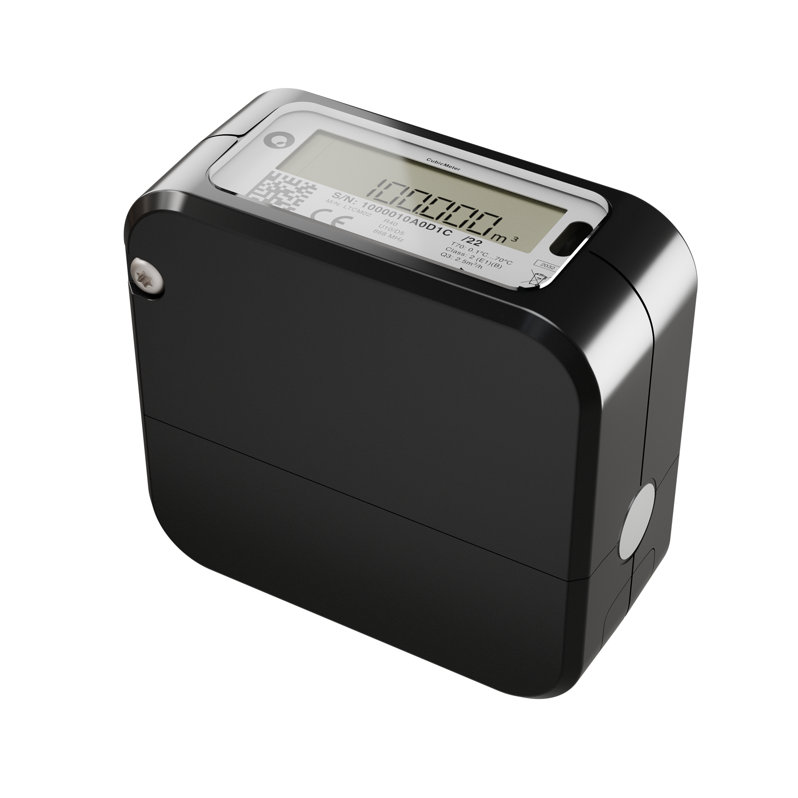
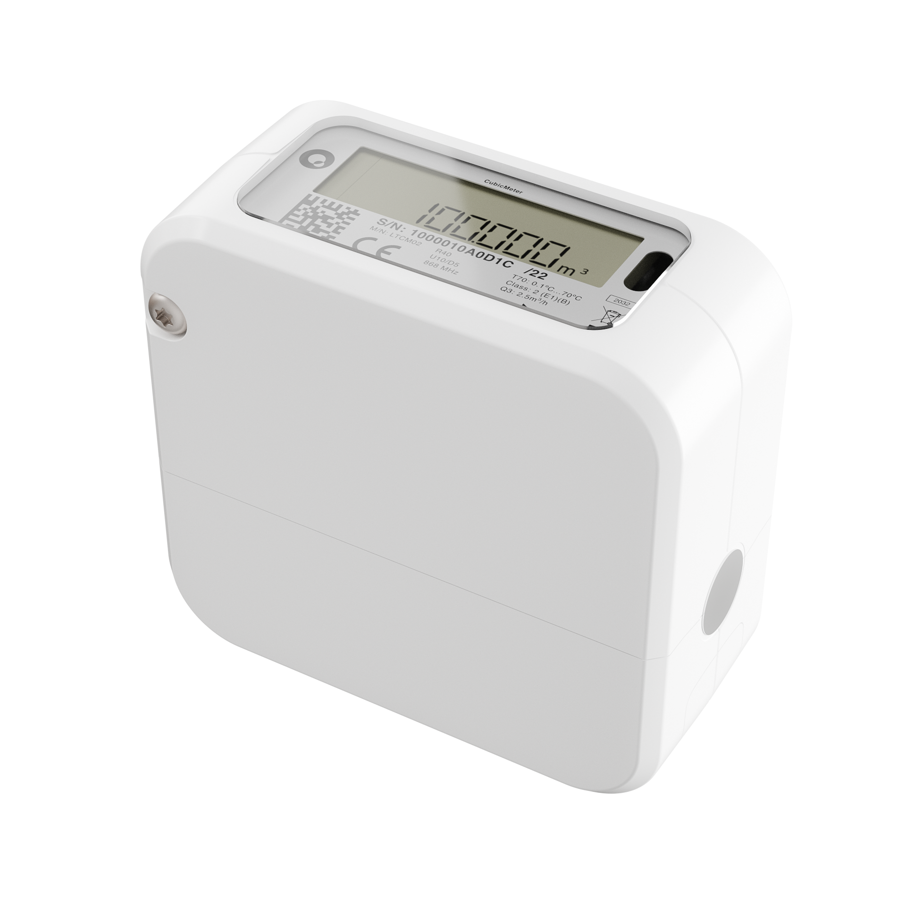

# CubicMeter 1.1



Clamp-on water flow meter and leak sensor.

The CubicMeter communicates over LoRaWAN.

The product comes in two versions, supporting either plastic or copper pipes.

- CubicMeter 1.1 Plastic (Black)
- CubicMeter 1.1 Copper (White)

https://quandify.com/cubicmeter

## LoRaWAN specifications

- LoRaWAN MAC version: 1.0.2
- Regional parameter version: 1.0.2 RevB
- Supports join: OTAA

## Decoder

The decoder defined in `src/uplink.js` parses the payload of an uplink and converts it into human readible text.

[Online decoder](https://quandify.github.io/cubicmeter-1.1/)

### Format

The format of the decoder complies with the [LoRa Alliance Payload Decoder API](https://resources.lora-alliance.org/technical-specifications/ts013-1-0-0-payload-codec-api).

### Output

Example of a decoded status report.

```
{
  data: {
    fPort: 1,
    length: 28,
    hexBytes: "49FBDF010000DE1400000000000046EDDF0106FC8B0702E2E6535455",
    type: "statusReport",
    decoded: {
      errorCode: 0,
      isSensing: true,
      totalVolume: 5342,
      leakState: 2,
      batteryActive: 3608,
      batteryRecovered: 3640,
      waterTemperatureMin: 21.5,
      waterTemperatureMax: 22,
      ambientTemperature: 22.5,
    },
  },
  warnings: [],
  errors: [],
}
```

### Prettify

The output can be prettified using the use the `normalizeOutput` function.

```
{
  data: {
    air: {
      temperature: 22.5,
    },
    battery: 3.64,
    metering: {
      water: {
        total: 5342,
      },
    },
    water: {
      leak: "",
      temperature: {
        max: 22,
        min: 21.5,
      },
    },
  },
  errors: [],
  warnings: [],
}
```

# Uplinks

| FPort | Decription        |
| ----- | ----------------- |
| 1     | Status report     |
| 6     | Downlink response |

## Status report

fport: 2

| Bytes | Label                   | Type   | Unit                    | Range        | Description                                                                                                         |
| ----- | ----------------------- | ------ | ----------------------- | ------------ | ------------------------------------------------------------------------------------------------------------------- |
| 0-3   | uptime                  | uint32 | Seconds                 | uint32 range | Time since last reset                                                                                               |
| 4-5   | error code              | uint16 | -                       |              | Current error code or 0 = No error. <br>The MSB is reserved for ERROR_MSG_NO_SIGNAL. <br>1 = error <br>0 = no error |
| 6-9   | total volume            | uint32 | Liters                  | uint32 range | All-time total volume since installation                                                                            |
| 10-13 | total heat              | uint32 | kCal                    | uint32 range | All-time total heat above the heat threshold (default 30°C) since installation.                                     |
| 14-20 | not supported           |        |                         |              | Data used for small leak detection in use with Quandify backend only                                                |
| 21    | leak state              | uint8  | -                       | [0 - 4]      | Leak state                                                                                                          |
| 22    | battery level active    | uint8  | Compact battery, mV     | [1800, 3600] | Battery level active, measured after wireless transmission                                                          |
| 23    | battery level recovered | uint8  | Compact battery, mV     | [1800, 3600] | Battery level recovered, measured during normal operation                                                           |
| 24    | water temperature min   | uint8  | Compact temperature, °C | [-20, 105]   | Min water temperature since last message                                                                            |
| 25    | water temperature max   | uint8  | Compact temperature, °C | [-20, 105]   | Max water temperature since last message                                                                            |
| 26    | ambient temperature     | uint8  | Compact temperature, °C | [-20, 105]   | Latest ambient temperature value                                                                                    |

### Leak state

| Value | Description |
| ----- | ----------- |
| 0     | No leak     |
| 2     | No leak     |
| 3     | Medium leak |
| 4     | Large leak  |

### Compact battery

Battery level, given with 8mv steps, starting from 1800mV.

Examples

Value _220_ → Battery level = 1800 + 220 \* 8 = 3560mV

### Compact temperature

Range _-20°C_ to + _105°C_ with _0.5°C_ step, encoded as uint8.

Math to obtain Temperature = (Value \* _0.5°C_) - _20°C_

_Examples_

Value _110_ → Temperature = (_110_ \* _0.5_) - _20_ = _35°C_

Value _32_ → Temperature = (_32_ \* _0.5_) - _20_ = _-4°C_

# Downlinks

> [!IMPORTANT]
> All downlink payloads must use least significant bit (LSB) hexadecimal format.

---

## Get hardware report

Ask the device for hardware related information. The response contains firmware and hardware version, app state and pipe type.

| Fport | Payload |
| ----- | ------- |
| 50    | 0       |

---

## Set status report interval

Set the interval for the periodic status reports.

> [!NOTE]
> Changing the interval affects the battery life of the device.

| FPort | Payload  | Value | Decription           |
| ----- | -------- | ----- | -------------------- |
| 19    | 58020000 | 600   | 10 minutes           |
| 19    | 08070000 | 1800  | 30 minutes           |
| 19    | 100E0000 | 3600  | 60 minutes (default) |

| Limit | Descripion |
| ----- | ---------- |
| Upper | 60 minutes |
| Lower | 10 minutes |

---

## Set pipe index

Change the type of pipe the device is mounted on.

### Supported pipes

_CubicMeter 1.1 Copper_

| FPort | Payload | Value | Type         | Description    |
| ----- | ------- | ----- | ------------ | -------------- |
| 4     | 01      | 1     | Copper 15 mm | Copper         |
| 4     | 02      | 2     | Copper 18 mm | Copper         |
| 4     | 03      | 3     | Copper 22 mm | Copper         |
| 4     | 04      | 4     | Chrome 15 mm | Chromed copper |
| 4     | 05      | 5     | Chrome 18 mm | Chromed copper |

_CubicMeter 1.1 Plastic_

| FPort | Payload | Value | Type      | Description           |
| ----- | ------- | ----- | --------- | --------------------- |
| 4     | 07      | 7     | PAL 16 mm | PE-RT/Aluminium/PE-RT |
| 4     | 08      | 8     | PAL 20 mm | PE-RT/Aluminium/PE-RT |
| 4     | 09      | 9     | PAL 25 mm | PE-RT/Aluminium/PE-RT |
| 4     | 0E      | 14    | PEX 16 mm | Plastic, PEX or PE-RT |
| 4     | 0F      | 15    | PEX 20 mm | Plastic, PEX or PE-RT |
| 4     | 10      | 16    | PEX 25 mm | Plastic, PEX or PE-RT |
| 4     | 11      | 17    | Distpipe  | LK Distance pipe 110  |

---

## Set app state

Sets the device into a specific state/mode.

| FPort | Payload | Value | Sate       | Description                              |
| ----- | ------- | ----- | ---------- | ---------------------------------------- |
| 2     | 04      | 4     | pipeSelect | Pipe selection mode                      |
| 2     | 05      | 5     | metering   | Metering mode (without 1h settling time) |

---

## Set flow direction

Sets the expected flow direction.

| FPort | Payload | Value | Description                                                    |
| ----- | ------- | ----- | -------------------------------------------------------------- |
| 13    | 01      | 1     | Forward (default)                                              |
| 13    | FF      | -1    | Reversed, to be used with meters that were installed backwards |

---

## Set LoRaWAN acknowledge enabled

Enable or disable LoRaWAN uplink acknowledge

| FPort | Payload | Value | Description                   |
| ----- | ------- | ----- | ----------------------------- |
| 20    | 00      | 0     | Disable acknowledge (default) |
| 20    | 01      | 1     | Enable acknowledge            |

--

## Set heat threshold

Change the heat threshold, from which the energy content of the water is accumulated.

`value = int(Temperature * 2^8)`

| FPort | Payload | Value | Description    |
| ----- | ------- | ----- | -------------- |
| 22    | 001E    | 7680  | 30°C (default) |

--

## Set total volume and heat

Set the total volume and heat to a specific value. Useful when replacing a meter and the total volume or heat should be kept.

| FPort | Bytes | Payload | Value | Description            |
| ----- | ----- | ------- | ----- | ---------------------- |
| 31    | 0-3   | 0000    | 0     | Total volume in Liters |
|       | 4-7   | 0000    | 0     | Total heat in kCal     |

--

## Perform volume reset

Reset the total volume of the device.

| FPort | Payload | Value |
| ----- | ------- | ----- |
| 101   | 0       | 0     |

---

## Perform lorawan reset

Reset LoRaWAN connection (e.g. for switch network)

| Fport | Payload | Value |
| ----- | ------- | ----- |
| 102   | 0       | 0     |

---

# Imlpementations

[The Things Network](https://github.com/TheThingsNetwork/lorawan-devices/tree/master/vendor/quandify)

[Akenza.io](https://github.com/akenza-io/device-type-library/tree/main/types/quandify)
